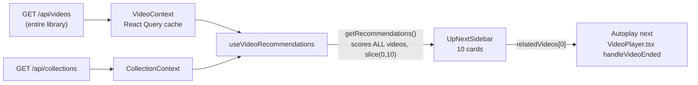
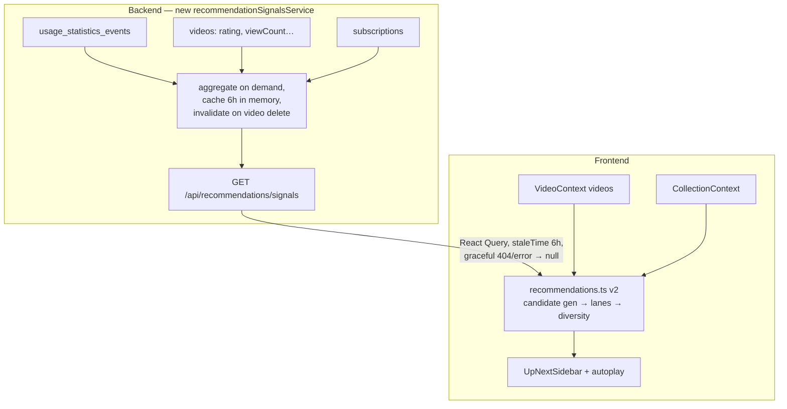

# Up Next Recommender — Review & Redesign

- **Date:** 2026-07-03
- **Status:** Proposal (no code changed)
- **Scope:** The "Up Next" sidebar and autoplay-next selection on the video player page
- **Author:** Claude (requested by Frank)

## Implementation status

- [x] Phase 1 — frontend heuristic ranker redesign completed on 2026-07-04.
- [x] Phase 2 — backend recommendation signals and client integration completed on 2026-07-04.
- [x] Phase 3 — Up Next feedback events, rollups, and replay evaluation completed on 2026-07-04.

---

## 1. Executive summary

Today's Up Next list is produced entirely in the frontend by a single linear scorer
([recommendations.ts](../frontend/src/utils/recommendations.ts)) that compares every video in the
library against the *currently playing* video using metadata similarity (collection, author, tags,
title tokens, dates, duration). It has no notion of the **user**: what they actually watch, finish,
abandon, re-watch, or rate. Meanwhile the app already collects exactly the behavioral data a good
recommender needs — per-session play events and 60-second watch chunks in
`usage_statistics_events` — and stores explicit signals (`rating`, `partNumber`/`totalParts`,
collection order, subscriptions) that the scorer ignores.

This document proposes a redesign in three phases:

1. **Phase 1 — fix the heuristics (frontend-only, no schema change).** Correct the broken
   sequence signal, use `rating` and `partNumber`, stop rewarding just-watched videos, add
   diversity, and cut wasted computation.
2. **Phase 2 — behavioral signals (backend aggregates + client ranker).** A small backend
   endpoint serves pre-aggregated taste and co-play signals mined from `usage_statistics_events`;
   the client blends them with metadata similarity in a three-lane layout: **Continue → Related →
   Discover**.
3. **Phase 3 — feedback loop & evaluation.** Record Up Next impressions/clicks and autoplay
   survival as statistics events, so recommendation quality becomes measurable and the weights
   stop being guesses.

The end state: the top of Up Next reliably continues what the user is doing (queue, series,
resume), the middle reflects both similarity *and* demonstrated taste, the tail surfaces fresh
downloads and worthy re-watches — and every change is measurable.

---

## 2. Current system review

### 2.1 Data flow



- The whole library is already client-side ([VideoContext.tsx:98](../frontend/src/contexts/VideoContext.tsx:98)),
  so the recommender runs locally with zero API latency.
- [useVideoRecommendations.ts](../frontend/src/hooks/useVideoRecommendations.ts) memoizes on a
  stripped-down copy of the current video and defers recomputation (`useDeferredValue`).
- The #1 ranked item is what autoplay navigates to
  ([VideoPlayer.tsx:335-350](../frontend/src/pages/VideoPlayer.tsx:335)), so ranking quality
  directly controls the lean-back experience.

### 2.2 Scoring model

`getRecommendations()` computes, for every other video in the library, a weighted sum:

| # | Signal | Weight | Computation | Assessment |
|---|--------|-------:|-------------|------------|
| 1 | recency | 0.08 | linear decay of `lastPlayedAt` over 1 year | **Backwards** — rewards videos you just finished (§3.5) |
| 2 | frequency | 0.04 | `viewCount / maxViewCount` | global popularity, near-noise at this weight |
| 3 | collection | 0.40 | binary: shares a collection or `seriesTitle` | good signal, but binary (no position awareness) |
| 4 | tags | 0.35 | Jaccard overlap of normalized tags | good when tags exist |
| 5 | author | 0.30 | binary exact `author` match | good; keyed on display name, not `channelUrl` |
| 6 | filename | 0.00 | unused | dead weight |
| 7 | sequence | 0.25 | next item in **whole-library** filename sort | **Broken by design** (§3.4) |
| 8 | source | 0.08 | same platform | weak proxy |
| 9 | title | 0.25 | Jaccard of title+filename tokens | decent lexical fallback |
| 10 | dateProximity | 0.08 | within 90 days (upload or added) | reasonable |
| 11 | duration | 0.05 | short/long ratio | reasonable |
| 12 | watchState | 0.20 | unwatched +1.0 · in-progress +0.7 · ≥90% watched −0.8 · viewCount≤2 +0.25 · else −0.1 | right idea, no time dimension (§3.5) |

Special paths that run **before** scoring:

- **Queue continuation:** if playing from a collection (`sourceCollectionId`) or an explicit
  playback queue, the remaining queue items are returned first, in order, followed by scored
  fallbacks. This is the strongest part of the current design and must be preserved.
- **Tie-breakers:** same-collection first, then natural filename order.

### 2.3 What already works well

- Queue/collection continuation is deterministic and correct.
- The scorer is pure, synchronous, unit-tested (417-line test file), and cheap to iterate on.
- `useDeferredValue` keeps ranking off the critical render path.
- Watch-state already tries to prefer discovery and resumable videos.

Any redesign should keep these properties: **pure ranking core, deterministic continuation,
client-side responsiveness.**

---

## 3. Problems with the current design

### 3.1 No user taste model

Scoring is purely *item-to-current-item* similarity. Two users (or the same user in different
months) with wildly different habits get identical rankings. The library knows which authors and
tags the user pours hours into — none of that shapes the list.

### 3.2 Behavioral data is collected but unused

The statistics subsystem ([eventTypes.ts](../backend/src/services/statistics/eventTypes.ts))
records, with a per-tab `sessionId`:

- `video_play_started` — every play session start, per video
- `video_watch_chunk_recorded` — qualified watch time in ≤60s chunks (`durationSeconds`),
  visibility/PiP-aware ([useStatisticsWatchTracker.ts](../frontend/src/hooks/useStatisticsWatchTracker.ts))

From these you can derive per-video completion rates, abandon rates, true watch-time per
author/tag, and **which videos are watched together or in sequence within a session** — the raw
material for co-play recommendations. The recommender uses none of it; it only sees the three
coarse columns on `videos` (`viewCount`, `progress`, `lastPlayedAt`).

### 3.3 Explicit signals ignored

- **`videos.rating`** — the user's own star rating. The single clearest "I like this" signal in
  the database. Unused.
- **`subscriptions.author`** — the user explicitly subscribed to these channels. Unused.
- **`collection_videos.order`** — curated ordering, honored by the queue path but invisible to
  scoring (membership is binary).

### 3.4 The sequence signal is broken by design

"Natural sequence" sorts the **entire library** by filename/title and boosts the single next
item ([recommendations.ts:221-229](../frontend/src/utils/recommendations.ts:221)). In a
multi-author library, alphabetic adjacency is meaningless: after "Zelda Part 3" from author A,
the "next" video might be "Zoo Vlog" from author Z. Meanwhile `partNumber`/`totalParts`/
`seriesTitle` — written by the downloader exactly for this purpose — are never consulted for
ordering (seriesTitle is only used as a binary same-series flag).

### 3.5 Re-watch bias and a missing time dimension

`recency` gives up to +0.08 to *recently played* videos and `frequency` up to +0.04 to
often-played ones — partially cancelling the −0.16 fully-watched penalty. Net effect: a video
you finished an hour ago can outrank an unwatched video from the same author. For a personal
media library the right model is a **re-watch cooldown curve**, not a static penalty: a finished
video is a terrible recommendation today, a mediocre one next week, and a fine one in three
months — especially if it's rated 5 stars or its author shows a high historical re-watch rate.

### 3.6 No diversity control

Same-collection (+0.40) and same-author (+0.30) are binary cliffs, so one author/collection can
flood all 10 slots. There is no cap, no interleaving, and no exploration — the list for a given
video is identical every single time, which trains the user to ignore it.

### 3.7 No feedback loop, so weights are unfalsifiable

Nothing records whether the user ever clicks Up Next items, at which position, or whether an
autoplayed video survives 30 seconds. `DEFAULT_WEIGHTS` were hand-tuned once and can never be
validated or improved with evidence.

### 3.8 Minor: wasted computation

Every recompute scores **all** videos: an O(N·C) collection-membership scan per candidate
(`collections.filter(c => c.videos.includes(...))` inside the map), a full O(N log N) library
sort for the (broken) sequence check, then sorts everything to keep 10. Fine at 500 videos,
noticeable at 5,000 — and all of it thrown away except the top ten.

---

## 4. Data inventory — what the database offers

From [schema.ts](../backend/src/db/schema.ts). ✅ = used today, ❌ = unused.

| Source | Attribute | Used? | Recommender value |
|--------|-----------|:-----:|-------------------|
| `videos` | `author` | ✅ | identity for taste profile; prefer `channelUrl` as stable key |
| `videos` | `tags` | ✅ | topic similarity + taste profile dimension |
| `videos` | `seriesTitle` | ✅ (binary) | series grouping — should drive *ordering* too |
| `videos` | `partNumber`, `totalParts` | ❌ | **exact next-episode ordering** |
| `videos` | `rating` | ❌ | explicit preference; re-watch candidate quality |
| `videos` | `description` | ❌ | lexical similarity fallback (TF-IDF tokens) when tags are sparse |
| `videos` | `channelUrl` | ❌ | stable author identity across display-name changes |
| `videos` | `viewCount`, `lastPlayedAt`, `progress` | ✅ | coarse watch state (kept as fallback) |
| `videos` | `addedAt` / `createdAt` | ✅ (weak) | freshness for the Discover lane |
| `videos` | `duration` | ✅ | session-fit; duration-band preference |
| `videos` | `visibility` | ✅ (upstream) | must stay filtered for visitors |
| `collection_videos` | `order` | ❌ (scoring) | position-aware continuation within curated lists |
| `usage_statistics_events` | `video_play_started` (videoId, sessionId, recordedAt) | ❌ | session sequences → co-play graph |
| `usage_statistics_events` | `video_watch_chunk_recorded` (durationSeconds) | ❌ | true watch time, completion & abandon rates |
| `usage_statistics_daily` | `watch_seconds`, `play_sessions`, `completion_bucket` | ❌ | cheap long-horizon aggregates (raw events prune after `statisticsRetentionDays`, default 365) |
| `subscriptions` | `author`, `paused` | ❌ | declared interest → taste prior |
| `download_history` | `sourceKind`, `subscriptionId` | ❌ | "manually downloaded" ≈ stronger intent than subscription backfill |

---

## 5. Proposed design

### 5.1 Design principles

A personal library is **not** YouTube, and the differences drive the design:

1. **Finite, known catalog** — every candidate can be scored; no retrieval problem.
2. **Single taste profile** (admin + visitor share one household profile; visitors just see a
   visibility-filtered view).
3. **Continuation dominates** — most sessions are "next episode / next in queue"; getting slot 1
   right matters more than anything else because autoplay consumes it.
4. **Re-watching is legitimate** — favorites, music videos, comfort content. Model *when* to
   resurface, not whether.
5. **Degrade gracefully** — statistics can be disabled or empty (fresh install); metadata-only
   ranking must remain a complete fallback.

### 5.2 Three-lane slate instead of one scalar ranking

Replace "sort everything by one score" with a slate of 10 slots filled from three lanes.
Unfilled lanes cede slots to the next lane, so the list is always full when the library allows.

```text
┌─ Lane A · CONTINUE (up to 3 slots, deterministic, in this priority) ─────┐
│ A1 explicit playback queue remainder (existing behavior, unchanged)     │
│ A2 source-collection remainder in collection_videos.order (unchanged)   │
│ A3 next episode: same seriesTitle, partNumber = current + 1;            │
│    else next unwatched by order within a shared collection;             │
│    else filename-adjacent WITHIN same author + series-like title stem   │
│ A4 resume: in-progress video (5% < progress < 90%) with the highest     │
│    behavioral affinity, if watched within the last 30 days              │
├─ Lane B · RELATED (5–7 slots, scored, diversity-constrained) ────────────┤
│ score = similarity(current, v) × affinity(user, v) × availability(v)    │
├─ Lane C · DISCOVER (up to 2 slots) ──────────────────────────────────────┤
│ C1 freshest unwatched video from a subscribed/high-affinity author      │
│ C2 re-watch pick: high rating or high rewatch-rate, past cooldown,      │
│    ε-greedy sampled from the top 20 so the slot varies between visits   │
└──────────────────────────────────────────────────────────────────────────┘
```

**Autoplay** consumes slot 1, which is Lane A whenever any continuation exists — this alone
fixes the worst current failure (autoplay jumping to an alphabetic neighbor from another
author). When only Lane B/C items exist, autoplay follows the top Related item, preserving
today's behavior.

### 5.3 Signals and formulas

All decayed quantities use exponential decay `d(t) = 2^(−age/half-life)`.

**Per-video behavioral aggregates** (from `usage_statistics_events`, fallback in parentheses):

| Signal | Definition | Fallback without stats |
|--------|-----------|------------------------|
| `watchSeconds` | Σ `durationSeconds` of chunks, half-life 90 days | `viewCount × duration` |
| `completionRatio` | watchSeconds per play session ÷ duration, clamped [0,1] | `progress / duration` |
| `abandonRate` | share of play sessions with < max(30s, 5% duration) qualified time | — (0) |
| `lastFinishedAt` | last session reaching ≥90% | `progress ≥ 90% ? lastPlayedAt : null` |
| `rewatchRate` | sessions beyond the first ÷ total sessions | `max(0, viewCount − 1)/viewCount` |

**Taste profile** (the "user" the current system lacks):

- `authorAffinity[a]` = decayed watch-seconds share of author `a` (key: `channelUrl ?? author`),
  +0.15 bonus if an active subscription exists, +small bonus scaled by mean rating of `a`'s videos.
- `tagAffinity[g]` = decayed watch-seconds share of tag `g`.
- `durationFit(v)` = closeness of `v.duration` to the watch-time-weighted duration distribution.

**Co-play graph** (session association mining — single-user item-to-item CF):

- For each statistics session, order `video_play_started` events by `recordedAt`; abandoned plays
  (see `abandonRate` threshold) are dropped.
- Directed edge `A→B` with weight `2^(−gap/2)` where `gap` = #plays between A and B in-session
  (adjacent = 1.0, one apart = 0.5, …), decayed by event age (half-life 120 days).
- `coPlay(A,B)` = shrunk score `w(A→B) / (w(A→*) + k)` with `k = 3` so two accidental
  co-occurrences don't dominate; keep top-20 neighbors per video.

**Re-watch cooldown** (replaces the static watched-penalty *and* the recency reward):

```text
rewatchMultiplier(v) =
  unwatched или never finished → 1.0
  finished, age = now − lastFinishedAt:
    base = 1 − 2^(−age / H)          // H = 45 days default
    boost = 1 + 0.3·(rating−3)/2     // 5★ recovers ~30% faster, 1★ slower
            + 0.5·rewatchRate         // proven re-watch favorites recover faster
    → clamp(base × boost, 0, 1)
in-progress (5–90%) → 1.15            // resumable beats everything comparable
```

**Lane B final score** (initial weights; Phase 3 makes them tunable with evidence):

```text
similarity =  0.30·sameCollection(position-aware: closer order = higher)
            + 0.25·authorMatch
            + 0.20·tagJaccard
            + 0.10·titleTokenJaccard        // + description tokens when tags absent
            + 0.05·dateProximity
            + 0.05·durationSimilarity
            + 0.05·sourceMatch

affinity   =  0.40·coPlay(current, v)                  // 0 without stats
            + 0.30·authorAffinity[v.author]            // 0 without stats
            + 0.15·tagAffinityDot(v.tags)              // 0 without stats
            + 0.15·(rating(v) − 3)/2                   // −1..+1, 0 if unrated

scoreB(v)  = similarity × (1 + affinity) × rewatchMultiplier(v)
             × (1 − 0.5·abandonRate(v))
```

The multiplicative form is deliberate: affinity *amplifies* relevant items rather than letting a
beloved-but-unrelated video outrank on-topic ones, and everything degrades to plain
`similarity` when behavioral data is absent.

**Diversity re-rank:** greedy fill of Lane B slots with a hard cap of 3 per author and 3 per
collection across the whole slate, skipping to the next-best candidate on violation
(MMR-lite; no pairwise similarity matrix needed).

### 5.4 Architecture: backend signal aggregates + client ranker (hybrid)

Full-backend ranking was considered and rejected (§9): the playback queue lives in client
navigation state, the library is already in the client, and a per-video-page API call adds
latency and a failure mode to a page that currently ranks instantly. Instead:



**Endpoint payload** (compact, size-bounded; ~100–300 KB for a 2,000-video library):

```ts
interface RecommendationSignals {
  computedAt: number;
  perVideo: Record<string, {           // only videos with ≥1 play session
    ws: number;                        // decayed watch seconds
    cr: number;                        // completion ratio 0..1
    ar: number;                        // abandon rate 0..1
    lf: number | null;                 // lastFinishedAt epoch ms
    rw: number;                        // rewatch rate 0..1
    nb: [string, number][];            // top-20 co-play neighbors [videoId, score]
  }>;
  authorAffinity: Record<string, number>;   // normalized 0..1
  tagAffinity: Record<string, number>;      // normalized 0..1
  durationBands: number[];                   // watch-time histogram for durationFit
}
```

Implementation notes:

- One SQL pass over `video_play_started` + `video_watch_chunk_recorded` grouped by
  `sessionId`/`videoId`; the existing index `idx_usage_statistics_events_video`
  (videoId, eventType, recordedAt) covers it. At the default 365-day retention a heavy user
  produces low hundreds of thousands of chunk rows — well within better-sqlite3 territory for a
  6-hourly cached computation.
- Visitor requests get the same payload minus entries for `visibility = 0` videos (compute once,
  filter per role), mirroring the existing visitor filter in VideoContext.
- If statistics are disabled or empty → `204 No Content`; the client ranker runs metadata-only.

### 5.5 Frontend changes

- `recommendations.ts` v2 keeps a pure, testable core with the same call sites but gains a
  `signals?: RecommendationSignals` parameter (as it already anticipates with the unused
  `weights` param).
- **Candidate generation replaces score-everything:** union of buckets — same collections,
  same author (top 50 by addedAt), tag-overlap matches, co-play neighbors, 30 most recent
  additions, in-progress videos — typically 100–300 candidates instead of N. Removes the
  per-candidate collection scan (build `videoId → collectionIds` map once) and the
  global-library sort entirely.
- New `useRecommendationSignals()` hook (React Query, 6 h staleTime, `enabled: statisticsEnabled`).
- `UpNextSidebar` optionally renders a subtle lane hint on the first Continue card
  ("Next episode" / "Resume") — small UX win, zero layout change.

### 5.6 Feedback loop (Phase 3)

New frontend event types (add to `FRONTEND_EVENT_TYPES` in
[eventTypes.ts](../backend/src/services/statistics/eventTypes.ts) and the collector allowlist):

| Event | Fields (payload) | Purpose |
|-------|------------------|---------|
| `up_next_impression` | slate videoIds + lanes, one event per slate render | denominator for CTR |
| `up_next_clicked` | videoId, position, lane | slot/lane CTR |
| `autoplay_advanced` | fromVideoId, toVideoId | autoplay volume |
| `autoplay_abandoned` | toVideoId, qualifiedSeconds < 30 | bad-handoff rate (the key quality metric) |

Rollup metric keys (`up_next_ctr`, `autoplay_survival`) join the existing daily rollups and can
surface on the statistics dashboard. Impressions are one event per page view (not per card), so
volume stays negligible next to watch chunks.

### 5.7 Settings

None initially. The system self-tunes to taste via signals; a "Prefer unwatched" toggle can be
added later **if** feedback data shows bimodal behavior. Respecting the existing
statistics-enabled setting is the only switch that matters (off → metadata-only mode).

---

## 6. Evaluation plan

**Offline replay (build in Phase 3, before touching weights):** for each historical qualified
transition A→B inside a session (excluding queue-driven plays, which are deterministic), rank
A's slate with candidate ranker vs. current ranker and report `hit@10`, `hit@3`, and MRR of B.
A ~200-line script in `backend/scripts/` against a copy of the production DB. This turns weight
tuning from vibes into a number.

**Online:** watch `autoplay_abandoned` rate and slot-1–3 CTR week-over-week after each phase
ships. Success criteria for the project: autoplay-abandon rate down ≥30%, Up Next CTR up
measurably, zero added latency on the player page.

**Unit tests:** the existing 417-line test suite carries over; new cases cover episode ordering
(`partNumber`), cooldown resurfacing, diversity caps, and signals-absent degradation.

---

## 7. Rollout phases

| Phase | Contents | Touches | Est. effort | Risk |
|-------|----------|---------|-------------|------|
| **1** | Sequence fix (partNumber/series/author-scoped), rating signal, re-watch cooldown replacing recency+watchState, diversity caps, candidate generation perf, position-aware collection scoring | frontend only | 1–2 days | low — pure function + existing tests |
| **2** | `recommendationSignalsService` + endpoint, `useRecommendationSignals`, affinity/co-play integration, three-lane slate, visitor filtering, graceful degradation | backend + frontend | 3–4 days | medium — new endpoint, cache lifecycle |
| **3** | 4 new event types + rollups, replay evaluation script, weight tuning pass, optional dashboard tiles | backend + frontend | 2–3 days | low — additive |

Each phase ships independently and improves the experience on its own; Phase 1 needs no
migration, API, or settings work at all.

---

## 8. Risks & mitigations

| Risk | Mitigation |
|------|------------|
| Statistics disabled / fresh install → empty signals | Multiplicative design degrades to metadata similarity; `204` handled as null |
| Feedback loop reinforces re-watch bubbles | Co-play capped at 0.40 of affinity; Discover lane reserved; cooldown gates finished content |
| Signals payload growth on huge libraries | Only videos with play history included; top-20 neighbor cap; gzip; hard cap with watch-seconds cutoff |
| Visitor leakage of hidden-video behavior | Signals filtered by `visibility` per role at the endpoint, same rule as VideoContext |
| SQLite load from aggregation | 6 h in-memory cache, computed off request path (kick on first request, serve stale meanwhile); covered by existing indexes |
| Ranking regressions vs. muscle memory | Phase-gated rollout; replay eval before weight changes; queue/collection continuation behavior intentionally unchanged |

---

## 9. Alternatives considered

1. **Full backend ranking endpoint** (`GET /api/videos/:id/recommendations`) — rejected: the
   playback queue is client navigation state, the library already lives in the client, and it
   adds per-page latency plus an offline failure mode for little gain at this scale.
2. **Embedding-based semantic similarity** (local sentence-encoder over titles/descriptions) —
   deferred: a heavyweight dependency for a self-hosted app; token-level TF-IDF over
   title+description captures most of the value at zero cost. Revisit if replay eval shows
   lexical similarity is the bottleneck.
3. **Learned ranker (logistic regression / GBDT on click feedback)** — premature: single-user
   click volume is too small to beat well-tuned heuristics; the Phase 3 eval harness is the
   prerequisite either way. The lane/score architecture leaves a clean slot for it later.
4. **Keep single-score ranking, just add signals** — rejected: a scalar blend keeps
   continuation, relevance, and discovery fighting over the same number; slot allocation is what
   guarantees the autoplay slot is always the *right kind* of recommendation.

---

## Appendix A — current vs. proposed signal usage

| Signal | Today | Proposed |
|--------|-------|----------|
| Collection membership | binary +0.40 | position-aware continuation (Lane A) + graded similarity (Lane B) |
| `seriesTitle` / `partNumber` | binary / unused | exact next-episode ordering (Lane A3) |
| Author | binary +0.30 | match (similarity) × watch-time affinity (taste) keyed on channelUrl |
| Tags | Jaccard +0.35 | Jaccard (similarity) × tag affinity (taste) |
| `rating` | unused | affinity term + cooldown boost |
| `viewCount`/`lastPlayedAt` | popularity + recency reward | fallback inputs to rewatch model only |
| `progress` | static watch-state buckets | resume lane + completion fallback |
| Watch chunks / sessions | unused | watch time, completion, abandon, co-play graph |
| Subscriptions | unused | author affinity prior |
| `addedAt` | date proximity only | freshness for Discover lane |
| Feedback (clicks/autoplay survival) | not collected | Phase 3 events → CTR/survival metrics → weight tuning |
